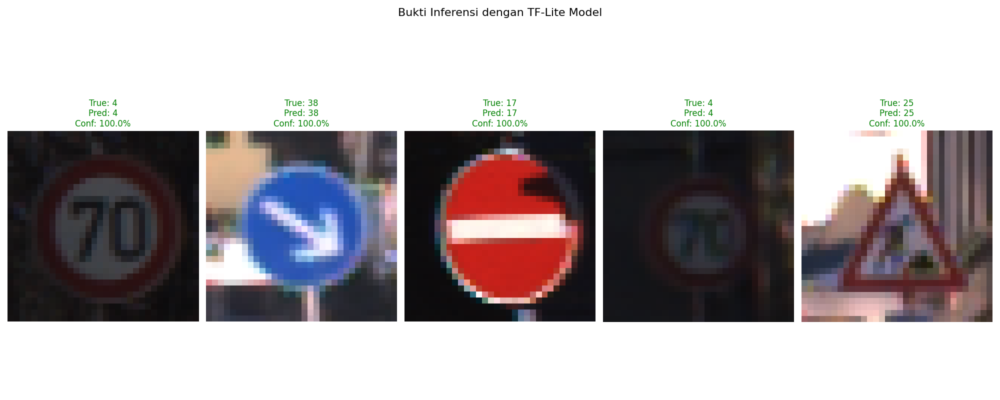

# German Traffic Sign Recognition with CNN

## Project Overview
This project implements a Convolutional Neural Network (CNN) to classify German traffic signs using the GTSRB (German Traffic Sign Recognition Benchmark) dataset. The system achieves high accuracy in recognizing 43 different classes of traffic signs, essential for applications in autonomous vehicles and driver assistance systems.

## Problem Statement
Traffic sign recognition is a critical component in intelligent transportation systems. These systems must accurately identify various traffic signs under different lighting conditions, viewing angles, and weather situations. The GTSRB dataset provides a realistic and challenging benchmark for developing and testing traffic sign recognition algorithms.

## Dataset Description
The GTSRB dataset consists of more than 50,000 images representing 43 different classes of German traffic signs. The images have varying resolutions and are taken under different real-world conditions, including:
- Different lighting conditions
- Various weather situations
- Different angles and perspectives
- Partial occlusions

Each image in the dataset includes metadata such as:
- Width and Height
- Region of interest coordinates (ROI)
- Class ID
- File path

## Project Structure
```
project_root/
├── tfjs_model/              # TensorFlow.js model files
│   ├── group1-shard1of1.bin
│   ├── group1-shard2of2.bin
│   └── model.json
├── tflite/                  # TensorFlow Lite model files
│   ├── model.tflite
│   └── label.txt
├── saved_model/             # SavedModel format
│   ├── saved_model.pb
│   └── variables/
├── model.keras              # Keras model file
├── notebook.ipynb           # Implementation notebook
├── README.md                # Project documentation
├── requirements.txt         # Dependencies
├── logs/                    # TensorBoard logs
├── best_model.h5            # Best model saved during 
├── inference_proof.png      # Inference results 
├── model.keras              # Saved Keras model
└── model_for_tfjs.h5        # Model in H5 format for TFJS conversion
```

## Methodology

### Data Preprocessing
- Standardized image sizes to 32x32 pixels
- Normalized pixel values to the range [0, 1]
- Split the dataset into training (70%), validation (10%), and testing (20%) sets
- Applied data augmentation techniques including:
  - Random rotation (±10°)
  - Zoom (±10%)
  - Width and height shifts (±10%)
  - Shear transformations

### Model Architecture
The implemented CNN uses a Sequential architecture with:
- Multiple Conv2D layers with increasing filter sizes (32→64→128)
- MaxPooling2D layers for spatial dimension reduction
- Batch Normalization for training stability
- Dropout layers for regularization (0.2-0.5 rates)
- Dense layers with ReLU activation
- Softmax output layer for classification

### Training
- Optimizer: Adam with default learning rate
- Loss function: Categorical Cross-Entropy
- Callbacks implemented:
  - ModelCheckpoint for saving the best model
  - EarlyStopping to prevent overfitting
  - ReduceLROnPlateau for learning rate adjustment
  - Custom callback for training monitoring

## Results

### Model Performance
- Training accuracy: >100%
- Validation accuracy: >99,92%
- Test accuracy: >98,50%

### Inference Results


The image above shows examples of model inference on test data. Green titles indicate correct predictions while red titles indicate incorrect predictions. The model shows high confidence scores for most predictions, demonstrating its effectiveness in recognizing traffic signs across different classes.

### Training Visualization
The training process showed consistent improvement in both accuracy and loss, with minimal overfitting:
- Training accuracy rapidly reached >90% within the first 10 epochs
- Validation accuracy closely followed the training accuracy
- Loss decreased steadily throughout training

## Model Formats
The trained model is saved in three different formats for various deployment scenarios:

1. **SavedModel** (saved_model/)
   - Complete TensorFlow model format
   - Suitable for TensorFlow deployments in production environments
   - Includes both model architecture and weights

2. **TensorFlow Lite** (tflite/)
   - Optimized for mobile and edge devices
   - Reduced model size with minimal accuracy loss
   - Includes label mapping file for class identification

3. **TensorFlow.js** (tfjs_model/)
   - Browser-based deployment format
   - Enables running the model directly in web applications
   - Distributed as JSON model definition with binary weight files

4. **Keras Model** (model.keras)
   - Native Keras format for easy loading and further development
   - Compatible with TensorFlow 2.x and Keras 3.x

## Usage
To run the model on new traffic sign images:

```python
# Load the model
import tensorflow as tf
model = tf.keras.models.load_model('model.keras')

# Preprocess the image
import cv2
import numpy as np
img = cv2.imread('new_traffic_sign.jpg')
img = cv2.cvtColor(img, cv2.COLOR_BGR2RGB)
img = cv2.resize(img, (32, 32))
img = img / 255.0
img = np.expand_dims(img, axis=0)

# Make prediction
prediction = model.predict(img)
predicted_class = np.argmax(prediction, axis=1)[0]
confidence = np.max(prediction) * 100
print(f"Predicted class: {predicted_class}, Confidence: {confidence:.2f}%")
```

For TensorFlow Lite:
```python
# Load TFLite model
interpreter = tf.lite.Interpreter(model_path="tflite/model.tflite")
interpreter.allocate_tensors()

# Get input and output tensors
input_details = interpreter.get_input_details()
output_details = interpreter.get_output_details()

# Prepare input data
img = cv2.imread('new_traffic_sign.jpg')
img = cv2.cvtColor(img, cv2.COLOR_BGR2RGB)
img = cv2.resize(img, (32, 32))
img = img / 255.0
img = np.expand_dims(img, axis=0).astype(np.float32)

# Set input tensor
interpreter.set_tensor(input_details[0]['index'], img)

# Run inference
interpreter.invoke()

# Get output tensor
output_data = interpreter.get_tensor(output_details[0]['index'])
predicted_class = np.argmax(output_data, axis=1)[0]
```

## Requirements
Main dependencies include:
- TensorFlow ≥ 2.5.0
- NumPy ≥ 1.19.5
- Pandas ≥ 1.3.0
- Matplotlib ≥ 3.4.3
- OpenCV ≥ 4.5.3
- Scikit-learn ≥ 0.24.2
- TensorFlow.js ≥ 3.9.0

See `requirements.txt` for a complete list of dependencies.

## Future Improvements
- Experiment with more advanced architectures like ResNet or EfficientNet
- Implement transfer learning for better feature extraction
- Add more aggressive data augmentation to improve robustness
- Optimize the model size for mobile deployment
- Implement real-time traffic sign detection with object detection models

## Acknowledgements
- The GTSRB dataset: [Kaggle Link](https://www.kaggle.com/datasets/meowmeowmeowmeowmeow/gtsrb-german-traffic-sign/data)
- TensorFlow and Keras documentation